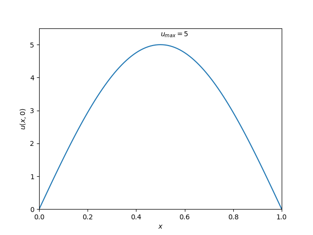

# Optimal Estimation of Temperature Change

Consider a one-dimensional steal bar over the interval . Let  be the temperature of the bar at location  and time . The changes in the temperature is governed by the equation:


<p align="center"></p>


The initial temperature is as follows:
<p align="center"></p>

This temperature profile looks like the following




```
> py forward_sim.py
```


